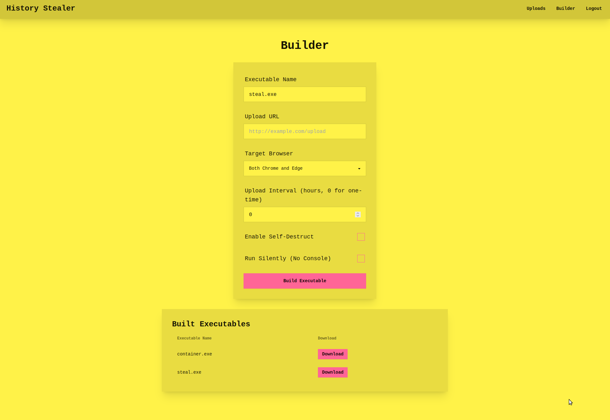

# History stealer
This challenge introduces players to exploit common mistakes that some threat actors make such as designing flawed C2(s). The player will learn how to reverse engineer a malware, trace a malware to a C2, hijack the C2 and hack the attacker's server.

It also teaches them what not to do if they were to run a similar attack and the C2 interface can be accessed if players were to bruteforce it, upon logging in, they would be able to interact with uploaded files, unzipped archives and the malware builder. 

Difficulty: Intermediate
Points: 300-500pts 




## Challenge description (given to players)
An election candidate's computer has been hacked with malware, the malware's task is to steal browser history files from Chrome & Internet Explorer and then compress them into a zip and upload them to a C2.

The incident response team have captured the executable binary that was used for data stealing. 

Can you find the C2 server & hijjack it?

The executable binary found on the cadidate's computer is here:
```
Executable_download_link_here
```


## Moving parts 
This challenge is going to have several moving parts such as:
- A web app & server for the C2
- An executable binary with a hardcoded but obfuscated C2 URL


### Web App
This Flask application uses a hardcoded PIN to protect routes that allow authenticated users to upload ZIP files, extract their contents (with a known Zip Slip vulnerability), browse or view extracted files, and download original ZIPs or generated executables; it also provides a builder interface where users submit parameters (executable name, upload URL, target browser, interval, self-destruct/silent flags) to invoke a `build_executable` function that creates new `.exe` files stored in a `builds` directory. 

The app ensures required folders (`uploads`, `unzipped`, `static`, `builds`) exist, handles login/logout via session flags, saves each uploaded ZIP under a sanitized “computer_name” filename, and on extraction writes files either under `unzipped/<computer_name>/...` or (if the archive path is absolute/contains `..`) under the system root, then returns JSON status codes. 

Static-serving routes distinguish `.zip`, `.exe`, and other file requests to send from their respective directories, while `/view` and `/explore` endpoints allow reading text files or listing directory contents in the unzipped area. Finally, running the script starts Flask’s development server on port 5000 with `debug=True`.


### Stealer program
This program stealthily collects Chrome/Edge user data, zips it, and uploads to a C2 server, optionally repeating on a schedule or self-destructing afterward. `Config` holds C2 URL, browser data paths, temp ZIP path, target browser(s), interval (`Hours`), and a `SelfDestruct` flag.

`BrowserDataZipper.CreateZip()` deletes any existing ZIP, creates a temp folder, and for each targeted browser copies files from the browser’s “User Data\Default” folder into the temp folder before adding them to `browser_data.zip`; it ignores file-in-use errors and deletes the temp copies when done.

`Uploader.UploadZipAsync()` checks for `browser_data.zip`, builds a multipart/form-data POST (including `computer_name` and the ZIP bytes) to the C2 URL using `HttpClient`, catches all exceptions, and deletes the ZIP afterward.

If `Config.SelfDestruct` is true, `SelfDestruct.DeleteSelf()` writes a batch script that waits briefly and then deletes the running executable and itself.

In `MainAsync()`, the code loops: call `CreateZip()`, await `UploadZipAsync()`, check `SelfDestruct` (delete and break if set), and if `Hours > 0`, wait that many hours before repeating. If `Hours == 0`, it runs once. Finally, it prints “Program running normally.” to the console.


**Compile with:**
```
mcs -sdk:4.5 -target:exe -out:./steal.exe -platform:x64 -r:/usr/lib/mono/4.5/System.Net.Http.dll -r:/usr/lib/mono/4.5/System.IO.Compression.dll -r:/usr/lib/mono/4.5/System.IO.Compression.FileSystem.dll -langversion:7.1 Program.cs
```

Grab C2 URL with:
```
strings -e l Program.exe
```


## Docker container setup 
Run:
```
sudo docker compose up --build

Use this for killing & starting a container with no cache:
sudo docker compose down && sudo docker compose build --no-cache && sudo docker compose up 
```

This will also copy flag.txt to `/root` directory of the docker container.


### Deployment advice
This challenge needs multiple server instances and one domain. After deploying the server, use its build interface and generate an executable that points to the URL where file_endpoint is located at. Example:
```
http://127.0.0.1/file_upload
```


# Contact
For any problems regarding this challenge, contact me on GitHub or Discord @0xHamy.


